# User Flow Diagrams Reference Guide

## Overview

User flow diagrams visualize how users interact with a product or feature. They map out every step, decision point, and outcome in a user's journey. This guide explains how to create comprehensive, interactive flow diagrams for PRDs.

## When to Create User Flow Diagrams

Create user flow diagrams when:
- The feature involves multiple user interactions or screens
- There are complex decision trees or branching logic
- Multiple user personas interact with the feature differently
- Edge cases and error handling need clear visualization
- Stakeholders need to understand the complete user experience
- Engineers need a visual reference for implementation

## Flow Diagram Structure

### Essential Flow Types

1. **Master Flow** - The complete end-to-end journey showing all major paths
2. **Persona-Specific Flows** - Detailed flows for each user type
3. **Feature-Specific Flows** - Deep dives into specific features or workflows
4. **Edge Case & Exception Flows** - Error handling and unusual scenarios

### Recommended Sections

For comprehensive products, include these sections:

1. **Master User Journey** - Complete flow from start to finish
2. **User Persona Journeys** - One flow per primary user type
3. **Core Feature Flows** - Individual flows for major features
4. **Decision Logic Flows** - Complex routing or algorithm visualizations
5. **Error & Edge Case Flows** - Exception handling and recovery paths
6. **Integration Flows** - Third-party service interactions
7. **Fulfillment/Completion Flows** - Post-action workflows

## Using the Template

The template file is located at `assets/user-flow-template.html`. To use it:

1. **Copy the template** to create your flow diagram
2. **Replace placeholders**:
   - `{{PRODUCT_NAME}}` - Name of your product/feature
3. **Update navigation** - Add links for each flow section
4. **Create flow diagrams** - Replace placeholder mermaid diagram with actual flows

### Template Placeholders

```html
{{PRODUCT_NAME}} - Replace with feature/product name
<!-- PLACEHOLDER: Add navigation links --> - Add nav links for all flows
<!-- PLACEHOLDER: Add flow diagrams --> - Add your mermaid diagrams
```

## Mermaid Flowchart Syntax

### Basic Structure


### Node Types


### Styling Nodes

Apply colors to convey meaning:


**Color Conventions:**
- `#4A90E2` (Blue) - Start/Standard processes
- `#48C78E` (Green) - Success/Completion
- `#FFB547` (Orange) - Decisions/Choices
- `#FF6B6B` (Red) - Errors/Exceptions
- `#9B59B6` (Purple) - Special/Premium processes

### Adding Icons

Use emoji or Unicode icons for visual clarity:

```mermaid
flowchart TD
    Start([📱 Open App]) --> Photo[📸 Take Photo]
    Photo --> AI[🤖 AI Processing]
    AI --> Decision{✅ Valid?}
    Decision -->|Yes| Success[💾 Save]
    Decision -->|No| Error[❌ Retry]
```



Common useful icons:
- 📱 Mobile/App
- 📸 Camera/Photo
- 🤖 AI/Automation
- 💾 Save/Store
- ✅ Success/Valid
- ❌ Error/Invalid
- 🔄 Sync/Refresh
- 🚀 Launch/Deploy
- 📦 Package/Product
- 💬 Message/Chat
- 👤 User
- 🏪 Store/Shop
- 🌐 Web/Online
- 📊 Analytics/Data
- ⚙️ Settings/Config

### Complex Flows

For longer flows, break them into logical sections:


## Flow Diagram Best Practices

### Structure

1. **Start with master flow** - Show the complete journey first
2. **Then break down** - Create detailed flows for each major section
3. **Keep flows focused** - Each diagram should tell one clear story
4. **Limit complexity** - If a flow has >15 nodes, consider splitting it
5. **Show decision points clearly** - Use diamond shapes and descriptive labels

### Labels and Descriptions

1. **Action nodes** - Use verb phrases: "Submit Form", "Validate Input"
2. **Decision nodes** - Use questions: "Valid Data?", "User Authenticated?"
3. **Decision edges** - Label clearly: "Yes/No", "Success/Fail", specific conditions
4. **Avoid jargon** - Use plain language unless it's a technical audience
5. **Add descriptions** - Include a text description above each diagram

### Visual Design

1. **Use consistent colors** - Apply the color convention throughout
2. **Add icons** - Make flows more scannable with relevant emoji
3. **Group related steps** - Use subgraphs for logical sections
4. **Show parallel processes** - When actions happen simultaneously
5. **Indicate time delays** - Use special nodes or labels for waits

## Example Patterns

### Simple Linear Flow


### Decision Tree Flow


### Error Handling Flow


### Multi-Path Workflow


## Integration with PRDs

### Placement in PRD

Add a link to the user flow diagram in the PRD:

```markdown
## 5. User Experience Flows

For detailed, interactive user flow diagrams showing all journeys and edge cases, see:
**[User Flow Diagrams](./user-flows.html)** (Open in browser)

### Quick Reference Flows

Below are simplified text flows for quick reference:

**Primary User Flow:**
1. User opens app
2. User takes photo
3. AI processes and identifies item
4. System suggests pricing
5. User confirms and saves
```

### When to Use HTML vs Mermaid in PRD

**Use HTML artifact (separate file):**
- Complex flows with 8+ diagrams
- Multiple user personas with different journeys
- Detailed edge case exploration
- When stakeholders need a comprehensive visual reference

**Use inline Mermaid in PRD:**
- Simple flows with 2-3 diagrams
- Quick reference flows
- Technical flows for developers
- When the flow is tightly coupled to a specific requirement

## Checklist for Complete User Flows

Before finalizing your user flow diagrams, ensure:

- [ ] Master flow shows complete end-to-end journey
- [ ] Each major user persona has a dedicated flow
- [ ] Core features have detailed flows
- [ ] Decision points are clearly labeled
- [ ] Error paths and edge cases are documented
- [ ] Colors follow the standard convention
- [ ] Icons enhance readability (not clutter)
- [ ] Navigation links work correctly
- [ ] Descriptions explain what each flow shows
- [ ] Flows align with functional requirements in PRD
- [ ] Technical team can implement from these flows
- [ ] Stakeholders can understand user experience from flows

## Advanced Techniques

### Showing State Changes


### Parallel Processing


### Time-Based Flow


## Common Mistakes to Avoid

1. **Too much detail** - Keep high-level, don't show every validation rule
2. **Missing decision criteria** - Label edges with clear conditions
3. **Dead ends** - Every path should lead somewhere
4. **Inconsistent styling** - Use colors consistently
5. **No context** - Add descriptions explaining what the flow shows
6. **Unclear nodes** - Use specific action verbs
7. **Missing error paths** - Show what happens when things go wrong
8. **Overusing colors** - Stick to the standard convention
9. **Ignoring mobile** - Consider mobile vs desktop flows if different
10. **Not linking to PRD** - Connect flows to functional requirements

## Resources

- [Mermaid Documentation](https://mermaid.js.org/syntax/flowchart.html)
- [Mermaid Live Editor](https://mermaid.live/) - Test diagrams before adding to PRD
- Template file: `assets/user-flow-template.html`
